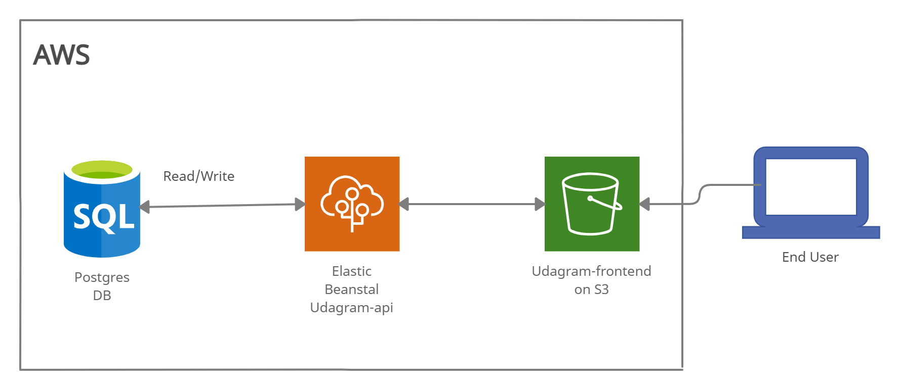

# Infrastructure

This full stack app use AWS services 
## AWS Services

### RDS
- postgres Database

### Elastic Beanstalk
- backend server running node-12 for hosting udagram-api

### S3
- a bucket for hosting udagram-frontend angular app
- a bucket for saving uploaded images

## Architecture Diagram
