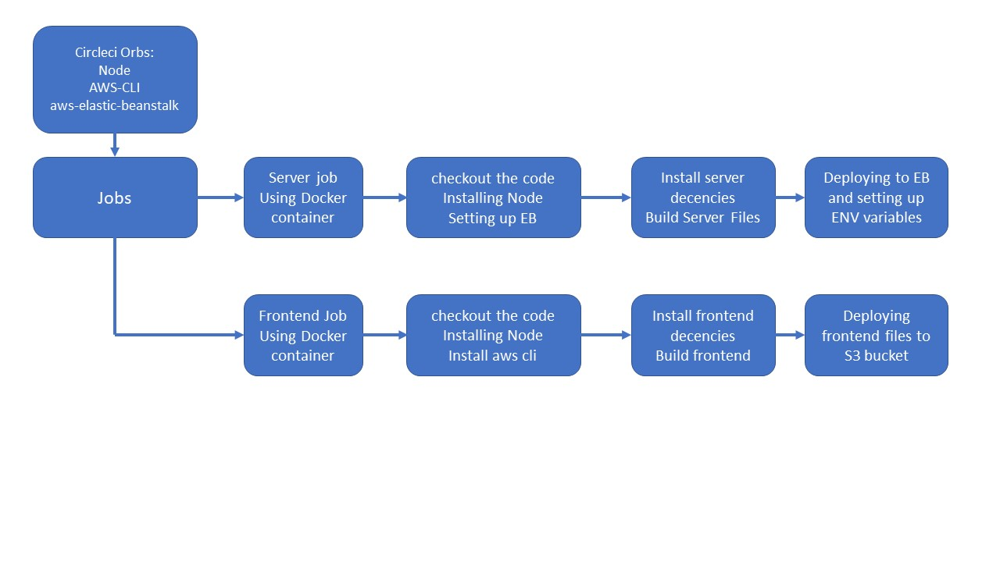

# Pipeline

- this pipline use CircleCI that is connected to GitHub

- all the pipline configuration lives inside the .circleci/config.yml

## Pipline Details

there are 2 workflows that run in parallel
- when pushing a new code to GitHub the pipeline is triggerd

the first workflow is for the server:
- Node, npm and elastic-beanstalk cli are installed
- the code is checkout from the GitHub repositry
- setuping elastic-beanstalk
- running the scripts to install the server and building the server
- initializing elastic-beanstalk
- setting environment variables from CircleCI to elastic-beanstalk app
- deployig the app

second workflow is for the frontend angular app:
- Node, npm and aws cli are installed
- the code is checkout from the GitHub repositry
- running the scripts to install and build the udagram-frontend app
- deploying the app to S3 bucket

## Pipline Overview Diagram

